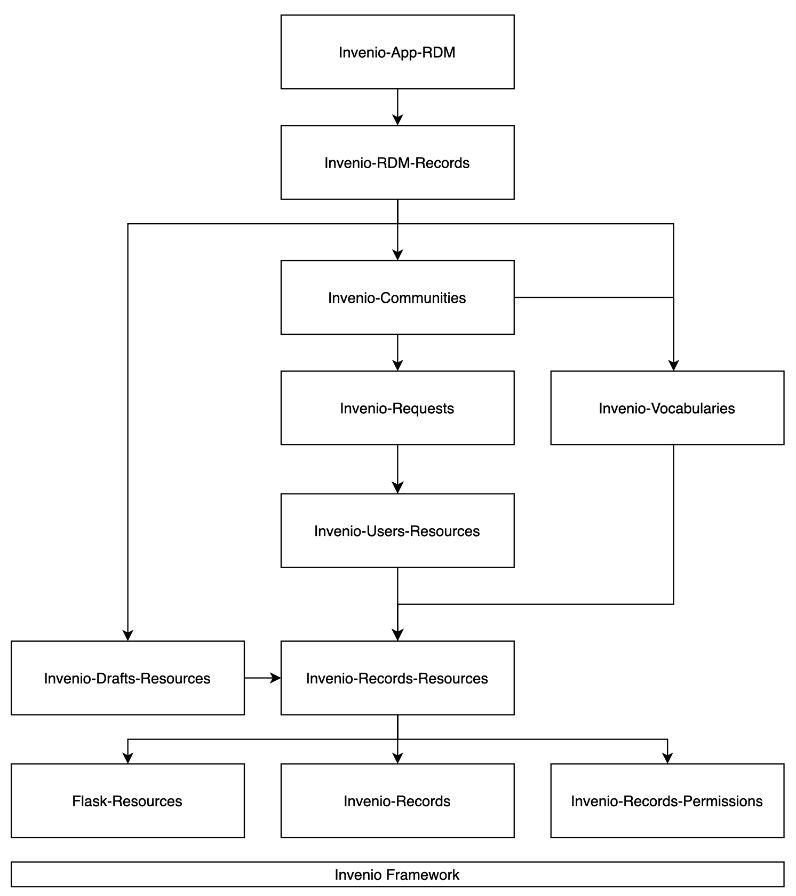

# The architecture of InvenioRDM

In order to understand how to work with InvenioRDM and make additions or configuration changes, you may find yourself trying to understand how it works. And you may find yourself failing, because InvenioRDM is so modular and decentralized that grasping how the pieces fit together is not straightforward. This document summarizes the architecture of InvenioRDM to help you figure it out.

## There's no main

In a typical application, you might start by looking for a `main` routine or its equivalent—that is, the entry point invoked to start up the software. In a web server architecture where Python code is executed inside a web server such as Apache or NGINX, there is no `main` in the application. Instead, the web server's interface to your Python application takes the form of one or more individual functions or objects that you associate with specific URLs, URL patterns, or events. When the appropriate conditions occur (such as a user trying to access a URL at your server’s address), the web server calls on the designated functions or objects. In this approach, your application is more a collection of routines.

Modern Python web frameworks employ [WSGI](https://en.wikipedia.org/wiki/Web_Server_Gateway_Interface), a set of conventions for how a web server should forward individual requests (arriving from users via HTTP) to one or more Python routines that collectively make up the application. There are many WSGI-based frameworks for Python, including Flask, Bottle, and others. The common theme in these frameworks is a software layer that interfaces between the web server proper (e.g., Apache) and code in an application.

In the present context, InvenioRDM is the application, and it uses Flask as its WSGI foundation.

## The foundation: Flask

In a WSGI-based system such as Flask, you define one or more separate functions (or more precisely, Python callables) and associate each one with a URL path on the server. For example, you might associate <https://myserver.org/action1> with code that is invoked to perform whatever `action1` is supposed to do. This is the basic purpose of Flask; all else is just elaboration on this basic purpose.

### Flask at its simplest

Here is an example of a simple Flask-based application:
```python
from flask import Flask

app = Flask('Simple Demo')

@app.route('/')
def hello_world():
    return '<p>Hello World!</p>'
```

If you started a web server on a host with this code, and then visited the top-level web page, the application above would respond by printing "Hello World!" in your web browser.

The code above shows the association of a Python function with a route (here, `/`) on the server. Using Flask, you can define other routes, and the route paths can employ variables (for example, you might have `/user/<username>`) that can be accessed by the code invoked for the route. Routes can also respond different to different types of HTTP requests (e.g., get versus post requests). In Flask, the output produced by an application can also use templates written in a syntax called Jinja2. Using these and other features, an application like InvenioRDM can have elaborate behaviors and produce rich content.

### Writing more complex applications in Flask

Once you reach a certain level of complexity in an application, it becomes useful to split up your code into modules. To support this goal, Flask introduces three concepts: _views_, _blueprints_, and _extensions_. All three are used throughout InvenioRDM, so it's necessary to get a basic sense of what they are.

A _view_ is an association between a request URL and code that produces a response to the request. In an application, a view returns data that Flask turns into an outgoing response. (Usually, views are discussed in the context of user interfaces and are said to be part of the "presentation layer" of an application, but in reality, Flask views are more generic and can be used for non-user API endpoints.)

A _blueprint_ is a grouping of views and code. It's Flask's approach to modularity: it allows an application to be split up into separate pieces. When using blueprints, an application has to register the individual blueprints with Flask. Here is a simple example; this code registers a blueprint that consists of a single view function (`user_view`) associated with a single route (`/user/<username>`):
```python
from flask import Blueprint

def user_view(username):
    return username

bp = Blueprint('myblueprint', 'mymodule')

bp.add_url_rule('/user/<username>', view_func = user_view)

app.register_blueprint(bp)
```

Finally, _extensions_ in Flask are packages that add configuration variables or settings, or perform other configuration steps. Extensions are loaded via another mechanism by Flask before the application is started. Typically, an extension comes into play when a blueprint needs some associated configuration steps to be performed in order to perform its work.

Complicated web applications are best handled by subdividing them into logical chunks. One approach to doing that is to have each such chunk define a Flask blueprint and an associated Flask extension. In that approach, the blueprint implements one or more views that are conceptually related (such as implementing user logins, or viewing files). Along with that, the associated extension might define configuration variables that are used to tailor the behavior of the blueprint and its views in a given site’s installation of the application.

## Building on the foundation: InvenioRDM modules

With the above as background, now it's possible to explain the architecture of InvenioRDM.

InvenioRDM is a collection of modules that register themselves with a base application built on Flask. Each  module in InvenioRDM implements functionality that is hooked into the overall application using Flask blueprints and extensions. The following diagram depicts the main modules:

<figure>

<figcaption><p align="center"><i>Diagram from <a href="https://inveniordm.docs.cern.ch/develop/getting-started/source-code">https://inveniordm.docs.cern.ch/develop/getting-started/source-code/</a>, version of 2022-10-14.</i></p></figcaption>
</figure>


What makes the Invenio architecture both flexible and a bit hard to grasp is that the modules are assembled into an application dyamically: there is no central configuration file or similar scheme that explicitly lists the modules loaded into a given InvenioRDM installation. Instead, the composition of an InvenioRDM application is determined by the modules installed (via `pip install`) into the Python environment where you try to run InvenioRDM. This is described in more detail below.

### The Invenio application factory

The base Invenio application is built from a number of modules. The following are the three most fundamental of those modules, although the "Invenio framework" box in the diagram above actually encompasses about a dozen additional modules besides these:

* [Invenio-Base](https://github.com/inveniosoftware/invenio-base)
* [Invenio-Config](https://github.com/inveniosoftware/invenio-config)
* [Invenio-App](https://github.com/inveniosoftware/invenio-app)

It is the module [Invenio-Base](https://github.com/inveniosoftware/invenio-base) that provides the core mechanism used to hook together the various Invenio modules into a complete application. The Invenio-Base module defines an application factory. This factory method looks in the Python environment at run time and searches for specific characteristics in something called _entry points_ (described below). It then imports Python modules based on what it finds, and calls on specific functions in every one of the modules it imports. The functions it calls are assumed to exist in the modules by virtue of the fact that every Invenio module must follow a set of conventions. Those functions install Flask blueprints, views and extensions that comprise each Invenio module.

In Invenio-Base's `app.py`, the function `create_app_factory` encapsulates these operations. To understand how it does what it does, it's necessary to follow the code, which leads to the function `_loader` in that file. Here is an edited version of that function, in which some symbols have been renamed to avoid some confusing parts of the original code:
```python
from importlib_metadata import entry_points

def _loader(app, init_func, entry_point_names=None, modules=None):
    if entry_point_names:
        for name in entry_point_names:
            for ep in set(entry_points(group=name)):
                try:
                    init_func(ep.load())
                except Exception:
                    app.logger.error(f"Failed to initialize entry point: {ep}")
                    raise
    if modules:
        for m in modules:
            try:
                init_func(m)
            except Exception:
                app.logger.error(f"Failed to initialize module: {m}")
                raise
```

As can be seen above, the function makes use of Python's `importlib_metadata` module. It works by iterating over the entry points defined _in the entire Python environment_, looking for ones in specific groups (which is something passed into `_loader` function by its caller). Looking for these entry points is how Invenio avoids the need for a master configuration file or other list that defines which components need to be loaded in order to compose a working InvenioRDM system.

But just exactly what are these entry points? Where do they come from?

### The glue: setuptools entry points

"Entry points" turn out to be a [standard feature of Python's setuptools module](https://setuptools.pypa.io/en/latest/pkg_resources.html#entry-points). They are a way for Python software distributions to "advertise", in a global-to-the-Python-environment way, whatever functionality they make available for use by other Python modules. The documentation for `setuptools` explains it well:

> Extensible applications and frameworks can search for entry points with a particular name or group, either from a specific distribution or from all active distributions on sys.path, and then inspect or load the advertised objects at will. Entry points belong to “groups” which are named with a dotted name similar to a Python package or module name.

There is a [Stack Overflow answer](https://stackoverflow.com/a/9615473/743730) that also explains it pretty well.

And how does one define these entry points? It is done using the `setup.cfg` file for a module. Here is an example from the `setup.cfg` file of the Invenio-Webhooks module:
```ini
[options.entry_points]
invenio_base.api_apps =
    invenio_webhooks = invenio_webhooks:InvenioWebhooks
invenio_base.api_blueprints =
    invenio_webhooks = invenio_webhooks.views:blueprint
invenio_base.models =
    invenio_webhooks = invenio_webhooks.models
invenio_db.models =
    invenio_webhooks = invenio_webhooks.models
```

Note how this module defines many entry points: the overall module class (`InvenioWebhooks`), blueprints, and database object models. This pattern is followed more or less by all the other Invenio modules. Each one has a set of entry_points (some more than others), which are discovered by the application framework.

### The chain of software dependencies

When you install InvenioRDM, you don't have to do a lot of individual `pip install` commands to get several dozen modules installed—you only do one. So, _something_ knows which modules to pull together in order to create an installation of InvenioRDM. What is that something?

It is the dependencies list in the `setup.cfg` configuration file of the top-most module, [Invenio-App-RDM](https://github.com/inveniosoftware/invenio-app-rdm). Looking into that file, we find a list of installation requirements:
```ini
[options]
install_requires =
    # Invenio core modules
    invenio-app>=1.3.4,<1.4.0
    invenio-base>=1.2.11,<1.3.0
    invenio-cache>=1.1.1,<1.2.0
    invenio-celery>=1.2.4,<1.3.0
    invenio-config>=1.0.3,<1.1.0
    invenio-i18n>=1.3.1,<1.4.0
    invenio-db[postgresql,mysql,versioning]>=1.0.14,<1.1.0
    # Invenio base bundle
    invenio-admin>=1.3.2,<1.4.0
    invenio-assets>=1.3.0,<1.4.0
    invenio-formatter>=1.1.3,<1.2.0
    invenio-logging[sentry-sdk]>=1.3.2,<1.4.0
    invenio-mail>=1.0.2,<1.1.0
    ... more omitted ...
```

Installing Invenio-App-RDM thus causes a lot of other Invenio modules that it depends on (some of which depend on others) to be installed at the same time. Each of those modules has its own entry points definitions, which setuptools adds to the global entry points defined in the Python environment where the modules are installed.

### The one ring that rules them all

One last aspect of this scheme need to be explained to get the complete picture. The installation instructions for InvenioRDM never actually have you install the `invenio-app-rdm` package. The instructions _actually_ tell you to install `invenio-cli`. What's going on?

It turns out that the [Invenio-CLI](https://github.com/inveniosoftware/invenio-cli) module is special: it has hardwired knowledge about how to create an InvenioRDM installation, and it runs the equivalent of `pip install` itself when you run the command [described in the InvenioRDM installation instructions](https://inveniordm.docs.cern.ch/install/):
```sh
invenio-cli init rdm
```

And there you have it. Invenio-CLI installs the Invenio-App-RDM module, which causes all the other InvenioRDM modules to be installed, each of which defines varous entry points. At run time, when you start up InvenioRDM, the application factory looks up the entry points, runs the associated functions (which install Flask blueprints and other elements), and builds up the overall Flask-based application.
